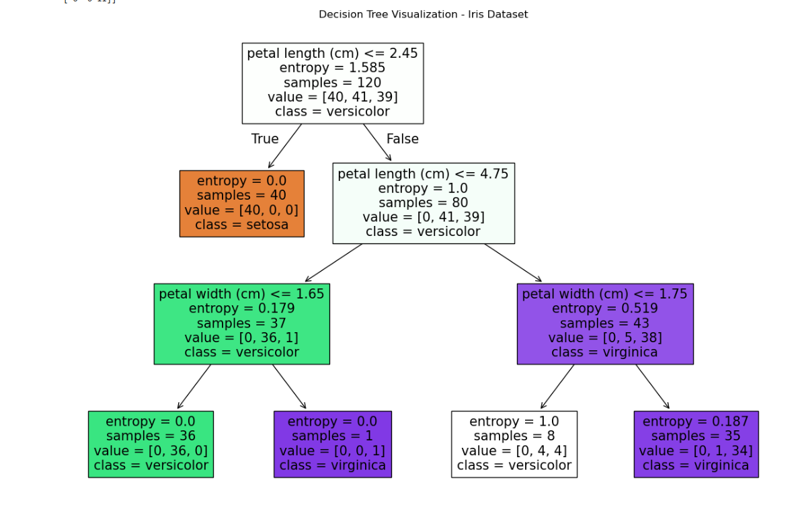

# 🌳 Decision Tree Visualization with scikit-learn

This project helps you **visually understand how a Decision Tree splits the dataset step-by-step**, using Python, `scikit-learn`, and `matplotlib`.

The notebook shows:
- How decision boundaries are formed
- How different features are used at different splits
- Gini index vs entropy-based splitting
- Graphical tree structure using `plot_tree`

---

## 📁 Files Included

- `CODTECH_TASK-1.ipynb` — Main Jupyter notebook that walks through training a Decision Tree and visualizing splits
- `decisionntree.png` — Sample output image of the decision tree

---

## 📷 Visualization Example



---

## 🔧 Requirements

Install the required libraries using:

```bash
pip install scikit-learn matplotlib pandas
